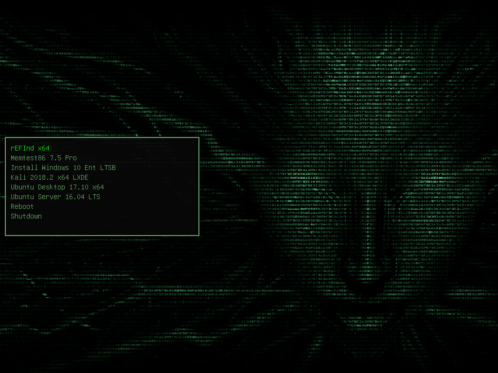

# GRUB2 Theme Shodan

A GRUB 2 Theme of the infamous System Shock character Shodan.

Original Author: "ieskeL"

Mirror of: https://www.pling.com/p/1251112

# Preview



# NixOS Example

Create a local derivation:
`./pkgs/grub2/shodan/default.nix`
```Nix
{ lib, stdenv, fetchFromGitHub }:
let
  src = fetchFromGitHub {
    owner = "JoshuaFern";
    repo = "grub2-theme-shodan";
    rev = "48516a0f4026dfc7bf9d957387f1f7590b9b7bda";
    sha256 = "8slxNzPzJUeR6w1qYi1RUUC2upxFL+RpklwI4BysdUg=";
  };
in
stdenv.mkDerivation {
  inherit src;

  name = "grub2-theme-shodan";

  phases = [ "installPhase" ];

  installPhase = ''
    mkdir -p $out/
    cp -r $src/Shodan/* $out
  '';

  meta = with lib; {
    description = "GRUB 2 Theme Shodan";
    homepage = "https://www.pling.com/p/1251112";
  };
}
```

Add it to your package list:
`./pkgs/pkgs.nix`
```Nix
self: super:
{
  grub2-theme-shodan = super.callPackage ./grub2/shodan{};
}
```

Import packages and set as GRUB theme:
`./configuration.nix`
```Nix
{ config, pkgs, ... }:

{
  boot.loader.grub.theme = with pkgs; grub2-theme-shodan;
  nixpkgs.overlays = [
    ( import ./pkgs/pkgs.nix )
  ];
}
```

Once you have this, it's pretty easy to adapt it to work with any GRUB2 theme you find.

# License

The original author licensed this work under CC0 so I felt comfortable posting it on github for easy integration with Nix, but I believe the background was not originally created by the author so I haven't posted this with any particular license on Github.
